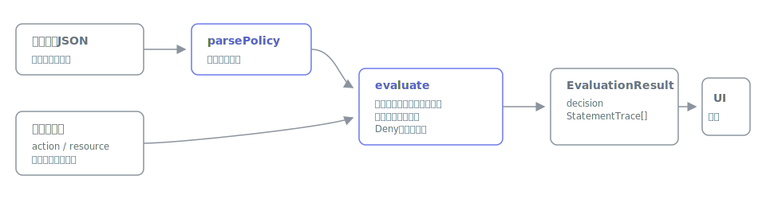

# polisim

[](https://github.com/miruky/polisim/actions/workflows/ci.yml)
[](https://www.typescriptlang.org/)
[](https://vitest.dev/)
[](https://opensource.org/licenses/MIT)

**IAMポリシーJSONが許可・拒否をどう決めるかを、ステートメント単位で追跡できるブラウザシミュレータです。**

## 概要

ポリシーJSONと評価したいリクエスト(アクション・リソースARN・コンテキストキー)を入力すると、各ステートメントのアクション照合・リソース照合・条件評価の結果をその場で表示し、「明示的Deny > Allow > 暗黙のDeny」という優先順位のどこで結論が決まったかを決定フロー図で示します。一致したワイルドカードパターン、否定形演算子のキー不在時の挙動、`ForAllValues` の空集合一致といった判断の根拠をすべてトレースとして残すので、「なぜこのリクエストが拒否されるのか」を1行ずつ確かめられます。評価はすべてブラウザ内で完結し、ポリシーやARNが外部へ送信されることはありません。

試す: https://miruky.github.io/polisim/

### なぜ作ったのか

IAMポリシーのデバッグは「変更して、適用して、実際に叩いて、CloudTrailかエラーメッセージを眺める」という遠回りになりがちです。AWSコンソールのPolicy Simulatorは実アカウントへのサインインが必要で、評価の内訳も最終結果しか見えません。とりわけ `StringNotEquals` がキー不在時に一致してしまう挙動や、明示的Denyの優先順位は、結果だけ見ても理由にたどり着きにくいものです。ポリシー文書だけを入力に、評価の途中経過を全部見せる小さな道具が欲しかったので作りました。

## 使い方

- ポリシーJSONを左のエディタに貼り付けるか、プリセット(明示的Denyの優先、MFA必須、IP制限、ポリシー変数、ForAllValues)から選びます
- リクエスト欄にアクション(`s3:GetObject` など)とリソースARNを入力します
- `aws:SourceIp` のようなコンテキストキーを追加すると、Conditionの評価に使われます。値はカンマ区切りで複数指定できます(複数値キー)
- 入力のたびに即時評価され、結論バナー・決定フロー図・ステートメントごとのトレースが更新されます

## アーキテクチャ



`parsePolicy` がポリシーJSONを検証して正規化し、`evaluate` が全ステートメントをリクエストに対して照合します。評価器は結論だけでなく、ステートメントごとの一致パターン・条件チェックの内訳を `StatementTrace` として返し、UIはそれを描画するだけです。解析・照合・評価はDOM非依存の純粋関数で、テストはこの層に集中しています。

## 技術スタック

| カテゴリ   | 技術                 |
| :--------- | :------------------- |
| 言語       | TypeScript 5(strict) |
| ビルド     | Vite                 |
| テスト     | Vitest(68テスト)     |
| リンタ     | ESLint + Prettier    |
| CI / CD    | GitHub Actions       |
| 配信       | GitHub Pages         |
| 実行時依存 | なし                 |

## 評価の仕様

- 適用されるステートメントの決定: `Action` / `NotAction`、`Resource` / `NotResource`、`Condition` のすべてが一致したステートメントだけが適用されます
- 結論の優先順位: 適用された `Deny` が1つでもあれば明示的拒否、なければ適用された `Allow` で許可、どちらもなければ暗黙の拒否です
- ワイルドカード: `*`(任意長)と `?`(1文字)。アクション名は大文字小文字を区別せず、ARNは区別します
- ポリシー変数: `Resource` 内の `${aws:username}` などをコンテキストの単一値で展開します。未解決の変数を含むパターンは何にも一致しません
- 条件演算子: String系・Numeric系・Date系・Bool・IpAddress / NotIpAddress(IPv4 CIDR)・Arn系・Null に対応し、`IfExists` と `ForAllValues:` / `ForAnyValue:` も扱います
- キー不在時の挙動: 肯定形は不一致、否定形は一致、`ForAllValues` は空集合として一致します。見落としやすいケースにはトレース上に注記が付きます

## プロジェクト構成

- `src/lib/policy.ts` — ポリシーJSONの解析と検証
- `src/lib/match.ts` — ワイルドカード照合とポリシー変数の解決
- `src/lib/condition.ts` — 条件演算子の評価
- `src/lib/evaluate.ts` — 評価本体とトレース生成
- `src/lib/examples.ts` — プリセットのポリシーとリクエスト
- `src/app.ts` — 画面の組み立てとイベント配線
- `src/main.ts` — マウント
- `docs/architecture.svg` — アーキテクチャ図

## はじめ方

### 前提条件

- Node.js 20 以上

### セットアップ

```bash
git clone https://github.com/miruky/polisim.git
cd polisim
npm install
npm run dev
```

### テストの実行

```bash
npm test
```

### Lintの実行

```bash
npm run lint
```

### デプロイ

`main` ブランチへのプッシュで GitHub Actions がビルドし、GitHub Pages へ配信します。

## 設計方針

- **過程を全部見せる** — 最終結果だけでなく、ステートメントごとの照合結果と条件チェックの内訳をトレースとして返す
- **ロジックの分離** — 解析・照合・評価をDOM非依存の純粋関数にし、テストで挙動を固定する
- **危険な挙動に注記を付ける** — 否定形演算子のキー不在一致やForAllValuesの空集合一致など、事故につながる評価には理由を明示する
- **データを外に出さない** — 評価はすべてブラウザ内で完結する

## 制約

評価対象はアイデンティティベースポリシー単体です。リソースベースポリシー(`Principal` を含むもの)、SCP、Permissions Boundary、セッションポリシーの合成は扱いません。`IpAddress` はIPv4のみ対応で、条件値内のポリシー変数展開と `BinaryEquals` は未対応です(未対応の演算子は不一致として扱い、トレースに明記します)。実際のAWSの挙動を完全に再現するものではないため、最終確認は実環境で行ってください。

## ライセンス

[MIT](LICENSE)
